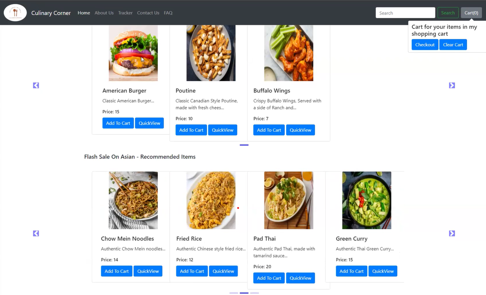
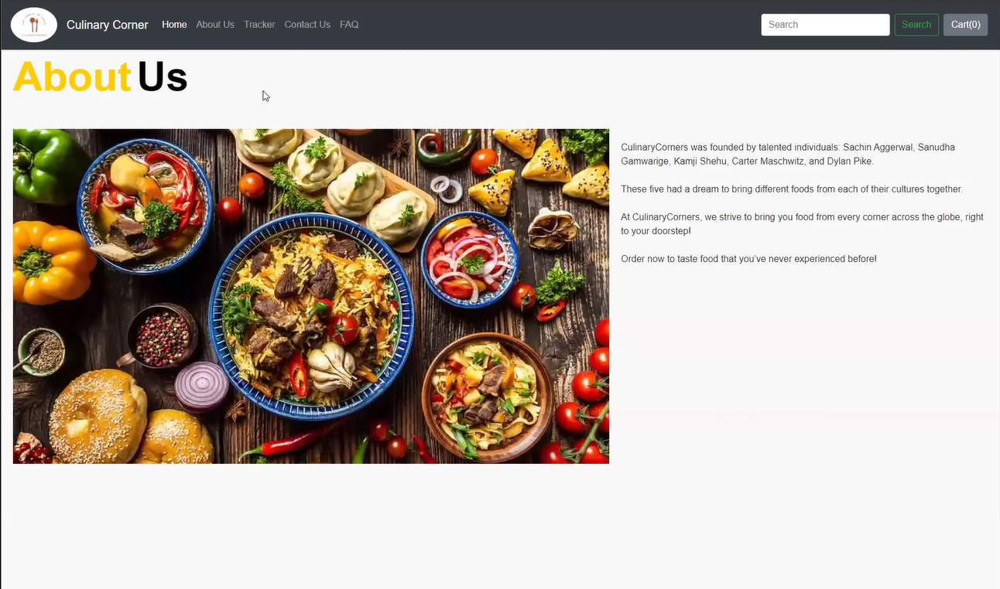

# IRM3004GroupAnteiku

# TEAM ANTEIKU README FILE

<h2 style="color: #3498db;">Team name: Team Anteiku</h2>
<h2 style="color : FFD95A;">Team number: Team 5</h2>

<h2 style="color : #C07F00;">A description of your application</h2>

-CulinaryCorners is a leading-edge online marketplace that provides a wide range of pre-made meals from all corners of the globe. With the help of our website, users can easily access real recipes, ingredients, and meal-kits and start cooking from the comfort of their own homes. CulinaryCorners delivers international cuisines right to your door with carefully chosen ingredients and simple-to-follow instructions, making cooking an engaging and pleasurable experience for foodies of all abilities.

<h2 style="color : #4C3D3D;">Screenshots:</h2>

    
	

<h2 style="color : #FFD95A;">Completed features</h2>
	-We have managed to successfully integrate a working shopping cart system. This allows you to add items to your shopping cart. There is also a functional counter that alerts you and lets you know how many items have been added. Clicking on the shopping cart also takes you to a page with all selected items ready to be bought.

	-We have implemented a linter. This allows us to keep our code to a certain nationally accepted standard. Code that does not pass this standard is not to be merged with the other code.

	-We have implemented a functioning carousel. This allows the items we have for sale to be cycled through in a clean and satisfying manner. This allows our users to see new items they may not have ever considered.

	-We have successfully integrated all the web pages that we have completed. The ‘Contact Us’ page and the ‘FAQ’ page are all accessible via the home page.
	-We have managed to implement a cohesive css that make all the pages look similar and related.

<h2 style="color : #C07F00;">Features not yet completed</h2>
	-We currently have webpages related to certain regions and their food that we haven’t yet completed but we plan to do so by next sprint.

	-Currently working on implementing automated tests for when we are trying to implement new code. This helps us recognize bugs and possible problems that need to be fixed.

<h2 style="color : #4C3D3D;">Canceled Features </h2>
	-Certain webpages for certain regions were canceled and merged with other regions due to multiple reasons. Some of these include, not having enough content to be a stand-alone and being very similar to other regions.

<h2 style="color : #FFD95A;">Product Goal:</h2>
By the end of developing our website, CulinaryCorners aims to have a one stop shop for a culinary experience, providing a diverse range of cuisines, convenient pre made meals and fresh/authentic ingredients for home cooking.

CulinaryCorners aims to enhance our user interface through regular menu updates, offering a range of new cuisines for users such as food enthusiasts, work professionals and home cooks.

Our product goal is highly strategic as it makes CulinaryCorners one of the leading culinary hubs within the online platform. It has a highly easy user interface that is highly clear and understandable, displaying a variety of features within areas such as cuisines, pre-made meals and fresh ingredients.

This goal will be monitored throughout various methods such as user engagement, order frequency and customer satisfaction. CulinaryCorners aim to be one of the top sites for culinary exploration within the meal/food industry.

Timeline of Completion: March, 4, 2024. Which will consist of all the basic requirements listed within the product goal. This also aligns with our timeline and milestones listed in the sprint goal.
